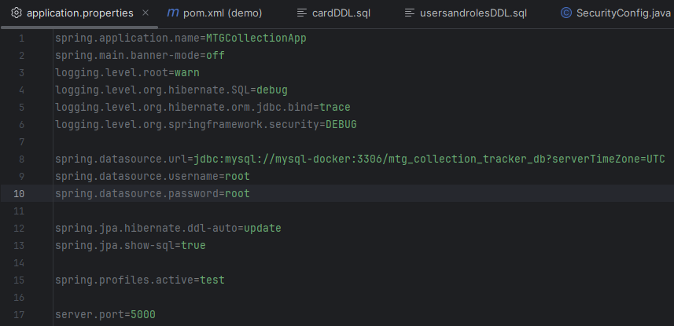
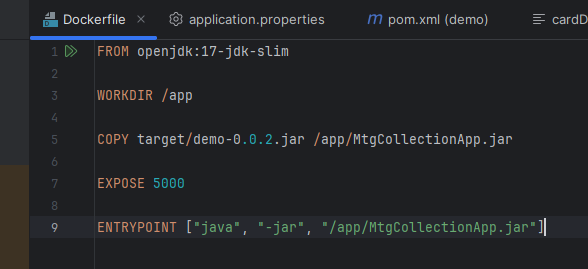
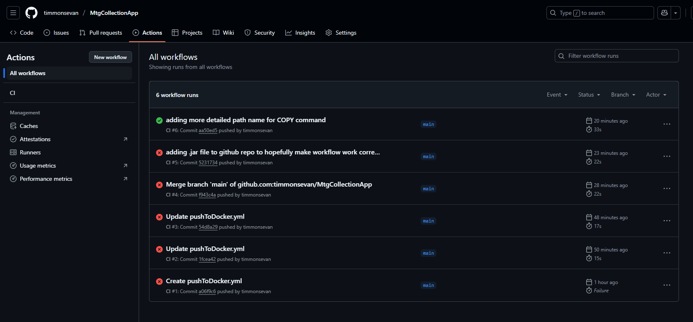
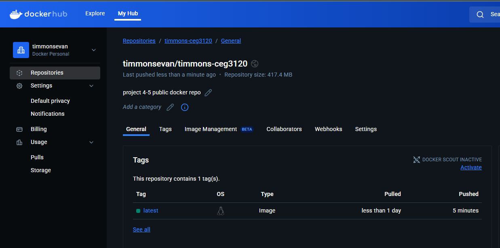

# Project 4 CI 

## Part 1 DOCKERIZE

### Docker setup

<p>Download docker desktop. Since I'm using WSL2, when installing docker desktop, configure WSL2 dependency and make sure the tab in the GUI is flipped on for ubuntu. Then run the followin commands in order:</p>

```
sudo apt-get update
sudo apt-get install ca-certificates curl
sudo install -m 0755 -d /etc/apt/keyrings
sudo curl -fsSL https://download.docker.com/linux/ubuntu/gpg -o /etc/apt/keyrings/docker.asc
sudo chmod a+r /etc/apt/keyrings/docker.asc

echo \
  "deb [arch=$(dpkg --print-architecture) signed-by=/etc/apt/keyrings/docker.asc] https://download.docker.com/linux/ubuntu \
  $(. /etc/os-release && echo "${UBUNTU_CODENAME:-$VERSION_CODENAME}") stable" | \
  
  # following command is nested inside previous command
  sudo tee /etc/apt/sources.list.d/docker.list > /dev/null
sudo apt-get update

sudo apt-get install docker-ce docker-ce-cli containerd.io docker-buildx-plugin docker-compose-plugin
```

<p>verify installation was successful with following command</p>

`sudo docker run hello-world`

### Setting up my containers && Dockerfile && Building images

<p>The CRUD app I've designed and am using for this project requires a mySQL server, so the first step is creating a container for mySQL. I did this by first downloading the docker image for
mySQL from docker hub using</p>

`docker pull mysql:latest`

<p>I then run the following command to construct a container for my database NOTE: your command will be different, this includes the name of my database</p>

`docker run -d -p 3308:3306 --name=mysql-docker --env="MYSQL_ROOT_PASSWORD=root" --env="MYSQL_PASSWORD=root" --env="MYSQL_DATABASE=mtg_collection_tracker_db" mysql`

<p>This command builds the container, binds it outwardly to port 3308 and inwardly to port 3306(mysql default port), names the container "mysql-docker", username root password root and the name of the database connecting to based off the application.properties file in my spring boot app (picture to follow)</p>



<p>Then with container built I use the following commands to go inside and make sure the tables are correct</p>

```
docker exec -it mysql-docker bash
    mysql -uroot -proot
        SHOW TABLES;
```

<p>Tables display and verify that mySQL container is built properly. Next is building the container for my Java app. First step was exporting Java app to a .jar file for the Dockerfile to use.
This is done by using the following command in windows powershell</p>

`mvn clean package`

<p>This generates your .jar file which is then used in your Dockerfile. My dockerfile looks like this:</p>



<p>I then use the following commands to first build the container, then run it on port 5000 and connect it to the mysql container</p>

```
docker build -t mtgcollectionapp-image .
docker tag <your container ID from docker desktop or docker image -a here> timmonsevan/timmons-ceg3120
docker run -t --link mysql-docker:mysql -p 5000:5000 mtgcollectionapp-image
```

<p>from the container side I am seeing green lights on docker desktop, no build errors on the command line and on the host side when I go to localhost:5000 in my browser, I see the app running!</p>

### DockerHub Repo

<p>To setup a PAT, I go to > account settings > personal access tokens, click generate new token and follow the two step procedure thereafter to generate it and then connect with it using</p>

`docker login -u <my username>`

<p>and then pasting the token into the password field that follows on the command line. Then to push my container image to my DockerHub repo, I used the following command:</p>

`docker push timmonsevan/timmons-ceg3120:latest`

[dockerhub repo](https://hub.docker.com/repository/docker/timmonsevan/timmons-ceg3120/general)

<p>The credentials to login to my app after running are username: root password: toor</p>

## Part 2 GitHub Actions and DockerHub

### Configuring GitHub Repository Secrets

<p>To create a Personal Access Token for Docker Hub, navigate to the top right corner of the webpage, click your inital, go to account settings, then to personal access tokens. Here you click
generate new token, which will walk you through the two step process, where you will decide permissions. I gave full read write and delete permissions because I wasn't fully comprehending what I was doing at the start, but now that I'm reflecting on it, I should have given only Read and Write permissions. GitHub Actions will not be deleting anything from DockerHub. Once the token is generated, DO NOT LEAVE OR NAVIGATE AWAY FROM THAT PAGE. On github, navigate to your repo's settings, then Secrets and Variables, then Actions. In that screen you will click on the New repository secret button. You will ultimately do this twice, once to create a secret named DOCKER_USERNAME, where the secret is your docker username, and the other time to create DOCKER_TOKEN,
which is your personal access token on the docker page you just generated, that once you navigate away from you will not see. These secrets will be used by github actions to access your Docker account.</p>

### CI with Github actions

<p>At this point I'm going to put a link to my personal github and public repo of the entire app demo that I am working with.</p>

[Evan's personal Github repo for the app](https://github.com/timmonsevan/MtgCollectionApp)

<p>Since I am incorporating my own app into this project, I chose to do this part's work in that repo as this is what makes sense for continuous integration continous deployment. If I was using the agile app the course work is based on, I would have done the github actions in the class repo. I will clarify this with Prof. Duncan in person.</p>

[my workflow yml](MtgCollectionApp/.github/workflows/pushToDocker.yml)

<p>As straightforward as this yml file appears, it took me several builds to get working. I started with a CI template from the GitHub recommended templates, hence the name CI. This workflow triggers ON PUSH whenever the main branch is pushed. Then the actual job(s) my workflow does, in this case it is one job, in three steps:</p>

- checkout code
- docker login
- build container and push to docker hub

### Testing and Validating

<p>When your workflow triggers succesfully, navigating to the actions tab will display present and past workflow triggers with a big nasty red x for if it failed, yellow for if it's working currently, and green if it succeeded. I knew my workflow worked properly because the green arrow happened, and then I refreshed my docker hub repo and it showed that it had been pushed to at that moment.</p>





<p>Then the final test was to run the app from containers after pulling the image from docker hub using the following commands</p>

```
docker pull timmonsevan/timmons-ceg3120:latest
docker run -t --link mysql-docker:mysql -p 5000:5000 timmonsevan/timmons-ceg3120:latest
```
