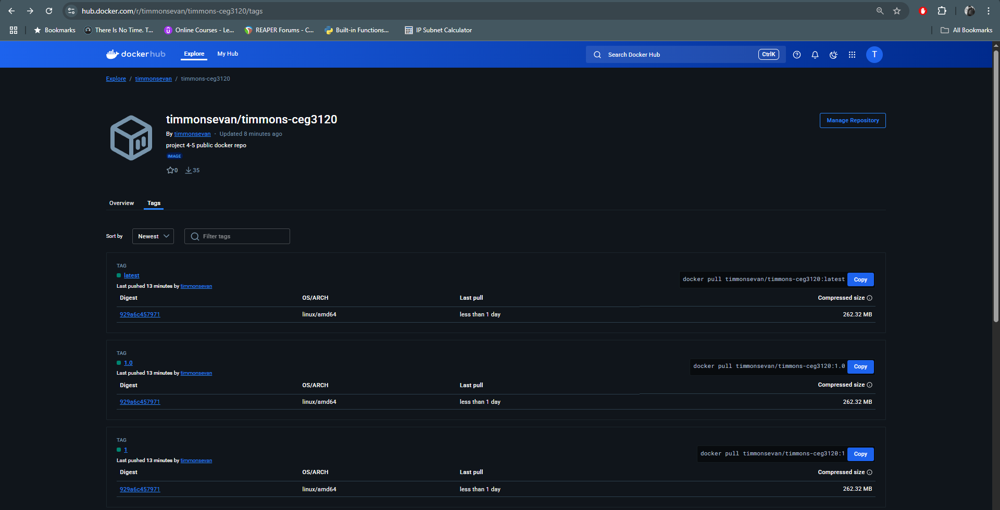
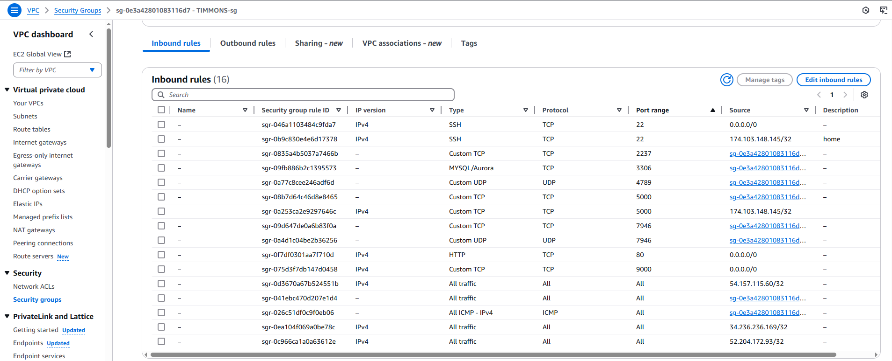

# Continuous Deployment

### tagging, semantic versioning

`git tag` 

- list all the tags in a git repository

`git tag -a <tag_name>` 

- create a tag with tag_name

`git push origin <tag_name>`

- push the tag to the current branch

<p>When I push a tag to my main branch, my workflow triggers and in this order: 1. runs a git checkout, 2. logs into docker hub using github secrets, 3. uses the docker metadata action to 
generate an image name and tag names, and finally 4. pushes the newly built image to dockerhub with three different tags, 1 is latest, 2 is <major> (v1.0.7 >> 1) and 3 is 
<major.minor> (v1.0.7 >> 1.0). When I eventually build my own personal dockerhub repository for this app, I will have to change the literal value "timmons-ceg3120" to my new repo name.Changes to the workflow shouldn't require any changes because I set up the github tag as a global variable at the top of my yml so whenever this workflow triggers it's always assigned the correct current tag. </p>

##### link to workflow

[github repo](https://github.com/timmonsevan/MtgCollectionApp/blob/main/.github/workflows/pushToDocker.yml)

- NOTE: this repository is public and should be visible

#### testing/validating workflow

<p>I had to test this workflow a lot to get it up and running but to ultimately check I had to go into the summary of the action, check that the metadata was generating valid tags, and finally when I got the green arrow I knew I was clear when I saw that I had correct versioning on my dockerhub repo, see image below. I then spun up a container utilizing the :latest tag and it works on http://localhost:5000 </p>



### EC2 instance details

- AMI: Ubuntu 24.04 
- ID: ami-084568db4383264d4
- t2.large (ran into heap issues with anything smaller!)
- 30GB



<p>Since I was working with a MySQL server and an app server I had to open up several ports to my own security group so that different entitities in my subnet could interact. I also made available port 9000 (webhooks listener) to 0.0.0.0/0 because GitHub, who's sending my payloads, has so many IPs they could send it from.</p>

##### Install Docker

- The following commands will install Docker on Ubuntu

```
sudo apt-get update
sudo apt-get install ca-certificates curl
sudo install -m 0755 -d /etc/apt/keyrings
sudo curl -fsSL https://download.docker.com/linux/ubuntu/gpg -o /etc/apt/keyrings/docker.asc
sudo chmod a+r /etc/apt/keyrings/docker.asc

echo \
  "deb [arch=$(dpkg --print-architecture) signed-by=/etc/apt/keyrings/docker.asc] https://download.docker.com/linux/ubuntu \
  $(. /etc/os-release && echo "${UBUNTU_CODENAME:-$VERSION_CODENAME}") stable" | \
  
  # following command is nested inside previous command
  sudo tee /etc/apt/sources.list.d/docker.list > /dev/null
sudo apt-get update

sudo apt-get install docker-ce docker-ce-cli containerd.io docker-buildx-plugin docker-compose-plugin
```

<p>To confirm docker is downloaded correctly and running I do a simple `sudo docker run hello-world`. This will come back with a confirmation that Docker is running smoothly if everything is set up correctly.</p>

### Testing EC2 instance

- pull a container from docker using `sudo docker pull <your_docker_username>/<docker_repo>`
- to stop previous container, `sudo docker stop <container-name>` and then remove the container with `sudo docker rm <container-name>`
- after pulling a new container and stopping old one, I usually run `sudo systemctl restart dcker` to refresh
- to run a container from image, `sudo docker run -d -p <machine-port>:<container-port> <image>`; the -d flag (detached mode) has the container run in the background which allows you to free up the terminal to continue using
- I would use -it flag to open a bash script in my containers with a `sudo docker exec -it <container> bash` which was very hand when setting up my mysql server and needing to manipulate DDL inside it
- to validate container is running, I run `sudo docker ps -a` which shows all my prvious process including my current one, which should show it listening on ports and have a status of being healthy and/or running
- I then go to my browser and enter `http://<app-public-IP>:5000/app` which brings up my webpage

#### deploy.sh

[deploy.sh](https://github.com/timmonsevan/MtgCollectionApp/blob/main/deployment/deploy.sh)
